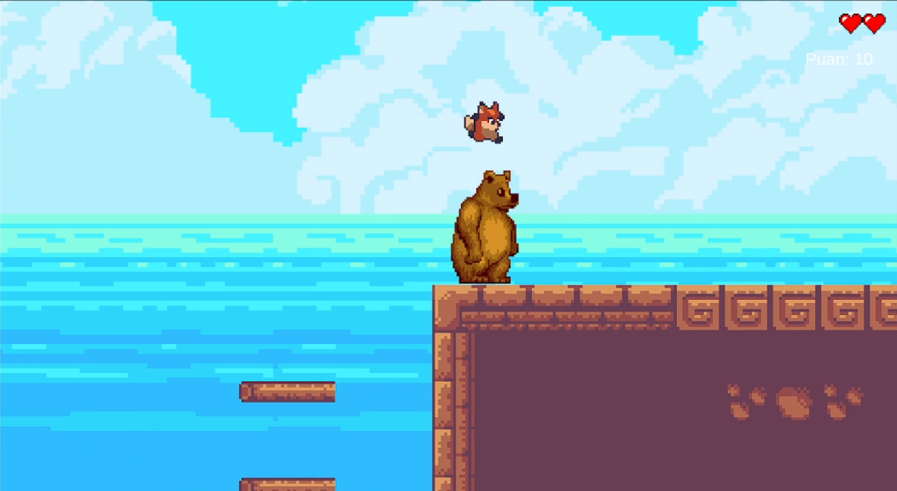
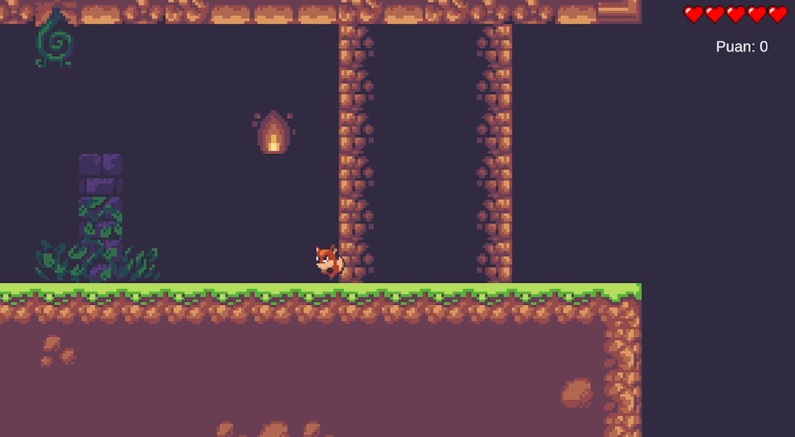
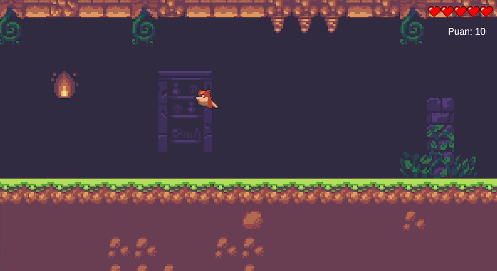

# IGP-SkyPixel - 2D Platform Game

<div align="center">


<p align="center">
  <b>A modern 2D Pixel Art Platformer built with Unity 6 (Universal Render Pipeline 2D), featuring fluid physics mechanics, AI-driven enemy patrols, and a robust binary serialization save/load system.</b>
</p>

</div>

---

## Gameplay & Screenshots

<div align="center">
  <table>
    <tr>
      <td align="center" width="50%">
        <b>⚔️ Combat & Stomp Mechanic</b><br>
        <i>Leaping over bear enemies to stomp and score points over bridge environments.</i><br><br>
        
      </td>
      <td align="center" width="50%">
        <b>🗺️ Platforming & Ruins Exploration</b><br>
        <i>Navigating through ancient dungeon ruins and tight obstacle structures.</i><br><br>
        
      </td>
    </tr>
    <tr>
      <td align="center" colspan="2">
        <b>🚀 Dynamic Jumping & Level Navigation</b><br>
        <i>Fluid aerial movement across multi-layered platforms and indoor chambers.</i><br><br>
        
      </td>
    </tr>
  </table>
</div>

---

## About the Project

**IGP-SkyPixel** is a feature-rich Unity project that combines the nostalgic charm of classic 2D platformers with modern game programming principles. Inspired by **Ansimuz**'s beloved *SunnyLand* pixel art asset pack, players navigate challenging platforms, collect diamonds/gems, and battle enemies featuring distinct behaviors and AI patterns.

This project demonstrates clean **Object-Oriented Programming (OOP)** architecture, **Raycast/Physics2D ground detection mechanics**, **state-driven enemy AI routines**, and a **Binary Serialization save/load system** that stores complete level snapshots across gaming sessions.

---

## Key Features

### 1. Fluid Character Controls & Combat Mechanics
- **Responsive Movement & Jumping (`PlayerCode`)**: Smooth horizontal velocity controls, precise ground check via `Physics2D.OverlapCircle`, and real-time animation transitions (`isWalking`, `isJumping`, `isFalling`) handled cleanly through Unity's Animator state machine.
- **Health & Damage System (`PlayerHitboxCode`)**: The player has 5 lives represented by heart UI icons (`Image[] _hearts`). Contacting enemy hitboxes triggers a life deduction, instantly spawning visual death effects (`_death` prefab) and updating the UI.
- **Stomp / Bounce Mechanic (`PlayerFootCode`)**: Just like in classic platformers, landing on top of an enemy while falling (`linearVelocityY < 0`) eliminates the enemy, launches the player back into the air (`linearVelocity.y = 5`), and rewards the player with +10 score points (as demonstrated in the combat screenshot).

---

### 2. Intelligent Enemy AI & Patrol Behaviors
Each enemy type is programmed with unique patrol algorithms and detection logic to keep gameplay challenging and dynamic:

| Enemy Type | Behavior & AI Mechanics | Script Reference |
| :--- | :--- | :--- |
| **Dog** | Equipped with `DogDetectionCode`, the dog detects when the player enters its awareness zone (`isAware`). Once alerted, it turns toward the player's X-coordinate and accelerates with burst impulse forces to chase and attack. Falls off cliffs gracefully (`y < -30f`) when dodged. | [DogCode.cs](./Assets/Scripts/DogCode.cs) |
| **Bear** | Patrols back and forth between defined boundary points (`minPosition` and `maxPosition`). When `BearDetectionCode` triggers player awareness, the bear gets enraged and **doubles its velocity (`_velocity * 2`)** for an aggressive pursuit. | [BearCode.cs](./Assets/Scripts/BearCode.cs) |
| **Bunny** | Moves by performing periodic jumps across terrain (`_jumpingVelocity`). Uses an internal jump counter (`counter`) to dynamically switch patrol directions every few hops while adjusting its jump/fall animations. | [BunnyCode.cs](./Assets/Scripts/BunnyCode.cs) |
| **Other Enemies** | **Hyena**, **Pig**, and **Vulture** provide varied ground and aerial obstacles across different level sections to test player timing and agility. | `HyenaCode.cs`, `PigCode.cs`, `VultureCode.cs` |

---

### 3. Binary Serialization Save & Load System
Instead of relying on basic `PlayerPrefs`, the project implements a secure, extensible, and high-performance **Binary Serialization (`BinaryFormatter`)** architecture to preserve game state.

- **What Gets Saved?**
  - **Player State (`PlayerData`)**: Current health (`health`), exact 3D world coordinates (`Vector3 position`), accumulated score (`score`), and active state (`isDead`).
  - **Enemies State (`EnemyData`)**: The exact positions and active/inactive status (`activeSelf`) of every enemy in the scene. (Defeated enemies remain dead when you load a saved game!)
  - **Collectibles / Gems (`DiamondData`)**: The active/collected state (`activeSelf`) and positions of all gems scattered throughout the level.
- **How It Works:**  
  `SaveSystem.cs` writes dedicated `.data` binary files (`player_1.data`, `enemies_1.data`, `gems_1.data`) directly into `Application.persistentDataPath` tailored specifically to the active scene/build index (`SceneManager.GetActiveScene().buildIndex`).

---

### 4. Multi-Level Structure & Scenes
The project consists of 3 core scenes:
1. `Start.unity` (**Main Menu**): Features a cinematic moving background sequence and interactive start prompt.
2. `1.Bölüm.unity` (**Level 1**): Introductory level introducing core platforming mechanics, gem collection, and forest/bridge enemy types.
3. `2.Bölüm.unity` (**Level 2**): Advanced level featuring complex platform layouts, increased enemy density, and tighter timing requirements.

---

## Controls & Keybindings

Use the following keyboard controls while playing or testing the game in the Unity Editor:

| Key / Input | Action / Function | Description |
| :---: | :--- | :--- |
| <kbd>A</kbd> / <kbd>D</kbd> or <kbd>←</kbd> / <kbd>→</kbd> | **Horizontal Movement** | Moves the character left or right across platforms. |
| <kbd>Space</kbd> | **Jump / Start Game** | Makes the player jump (when grounded). Also starts the game from the main menu. |
| <kbd>Q</kbd> | **Quick Save** | Instantly serializes and saves player health, position, score, plus all enemy and gem states. |
| <kbd>R</kbd> | **Quick Load** | Deserializes the `.data` save files and restores the entire scene to your exact saved snapshot. |
| <kbd>L</kbd> | **Reset / Load Level 1** | Quickly reloads Level 1 (`SceneManager.LoadScene(1)`) to start over. |

---

## Project Architecture & Folder Structure

```text
├── Assets\
│   ├── Animations\           # Animator Controllers and animation state machines for player & enemies
│   ├── Datas\                # Serialization & Data Persistence Scripts
│   │   ├── SaveSystem.cs     # BinaryFormatter read/write file management handler
│   │   ├── PlayerData.cs     # Serializable data class for player snapshot
│   │   ├── EnemyData.cs      # Serializable data class for enemy state
│   │   └── DiamondData.cs    # Serializable data class for gem state
│   ├── Prefabs\              # Prefabs for Player, Enemies, Death VFX, and Collectibles
│   ├── Scenes\               # Unity Scene files (Start, 1.Bölüm, 2.Bölüm)
│   ├── Scripts\              # Core Gameplay Mechanics and AI Controllers
│   │   ├── PlayerCode.cs     # Player movement, physics ground checks, and animation triggers
│   │   ├── PlayerHitboxCode.cs # Health deduction, death handling, and Save/Load hotkeys
│   │   ├── PlayerFootCode.cs # Enemy stomp/bounce collision check and score reward logic
│   │   ├── ScoreManager.cs   # Singleton score tracker and UI text updater
│   │   ├── EnemiesCode.cs    # Batch save/load controller for all child enemy instances
│   │   ├── AwardsCode.cs     # Batch save/load controller for all child gem instances
│   │   ├── DogCode.cs        # Dog AI awareness detection and pursuit logic
│   │   ├── BearCode.cs       # Bear AI boundary patrol and rage velocity boost logic
│   │   ├── BunnyCode.cs      # Bunny AI hopping physics and direction-switch logic
│   │   └── GemCode.cs        # Gem pickup trigger and score increment
│   └── SunnyLand_Artwork\    # Pixel art textures, tilemaps, characters, and backgrounds
├── images\                   # Gameplay screenshots and preview images
│   ├── image_1.png           # Stomp combat showcase screenshot
│   ├── image_2.png           # Ruins exploration screenshot
│   └── image_3.png           # Aerial navigation and jump dynamic screenshot
└── ProjectSettings\          # Unity URP configuration and New Input System settings
```

---

## Installation & Getting Started

1. **Prerequisites:**
   - Install [Unity Hub](https://unity.com/download) and **Unity 6 (6000.4.5f1 or newer)** with URP support.
   - Recommended IDE: **Visual Studio 2022** or **JetBrains Rider**.

2. **Opening the Project:**
   - Clone this repository to your local machine:
     ```bash
     git clone https://github.com/MuhammedYusufOngel/IGP-SkyPixel.git
     ```
   - Open **Unity Hub**, click on **Add**, and select the cloned folder.
   - Launch the project using Unity version **6000.4.5f1**.

3. **Running the Game:**
   - In the Unity Editor, navigate to `Assets/Scenes/Start.unity` inside the **Project** window and double-click to open it.
   - Press the **Play (▶)** button at the top of the Unity Editor to start playing!

---

## Developer & Credits

- **Project Developer**: Muhammed Yusuf Öngel
- **Artwork & Visual Assets**: Ansimuz (*SunnyLand Pixel Art Assets*)
- **Course / Assignment**: Introduction to Game Programming

---

<p align="center">
  ⭐ If you found this project helpful or inspiring, please consider giving it a star on GitHub! ⭐
</p>
